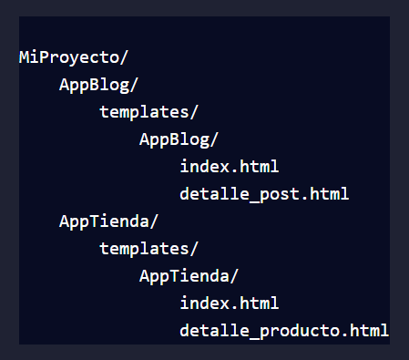

# 🎯 Templates

## Creación de Templates
En Django, los templates son archivos HTML que definen la estructura y presentación de las páginas web que se envían al navegador del usuario. Los templates permiten separar la lógica del negocio (controladores) de la presentación (vistas), facilitando la organización y mantenimiento del código.

## Pasos para Crear y Organizar Templates en Django

- **Paso 1: Configuración del Directorio de Templates**
Django busca los templates en los directorios especificados en la configuración del proyecto. Es recomendable tener una estructura clara y organizada para los templates.
    - Crear el directorio de templates: Dentro de la aplicación, crea un directorio llamado templates.
    - Crear subdirectorios para cada aplicación: Dentro del directorio templates, crea subdirectorios específicos para cada aplicación para mantener los templates organizados.

- **Ejemplo de estructura**: 


- **Paso 2: Configuración de la Ruta de Templates en settings.py**
En el archivo `settings.py` del proyecto, añade el directorio de templates a la configuración de TEMPLATES.

```python  
import os

TEMPLATES = [
    {
        'BACKEND': 'django.template.backends.django.DjangoTemplates',
        'DIRS': [os.path.join(BASE_DIR, 'templates')], # agregamos la ubicación de los templates
        'APP_DIRS': True,
        'OPTIONS': {
            'context_processors': [
                'django.template.context_processors.debug',
                'django.template.context_processors.request',
                'django.contrib.auth.context_processors.auth',
                'django.contrib.messages.context_processors.messages',
            ],
        },
    },
]
```

- **Paso 3: Creación de Modelo**
Creamos el modelo para guardar los Post: Dentro de el archivo `models.py` de nuestra aplicación creamos el modelo para guardar nuestros Post en la base de datos.

```python
from django.db import models

class Post(models.Model):
    titulo = models.CharField(max_length=200)
    contenido = models.TextField()
    fecha_publicacion = models.DateTimeField(auto_now_add=True)

    def __str__(self):
        return self.titulo  # Devuelve el título del post como su representación en cadena
```

Desde la consola corremos las migraciones: 
```bash
python manage.py makemigrations
python manage.py migrate
```

- **Paso 4: Creación de Templates**
    - Crear un template base: Es una buena práctica tener un template base que contenga la estructura común de la página, como el encabezado, pie de página y otras partes repetitivas.
    `base.html`:
    ```
    <!DOCTYPE html>
    <html lang="en">
    <head>
        <meta charset="UTF-8">
        <title>Mi Sitio</title>
    </head>
    <body>
        <header>
            <h1>Mi Sitio Web</h1>
            <nav>
                <ul>
                    <li><a href="#">Inicio</a></li>
                    <li><a href="">Blog</a></li>
                    <li><a href="#">Tienda</a></li>
                </ul>
            </nav>
        </header>
        <main>
            
            
        </main>
        <footer>
            <p>&copy; 2024 Mi Sitio Web</p>
        </footer>
    </body>
    </html>
    ```

    - Crear templates específicos para cada vista: Utiliza el template base para extender los templates específicos de cada vista.
    - `index.html` de AppBlog:
    ```
    

    Inicio - Blog

    
    <h2>Bienvenido al Blog</h2>
    <ul>
        
        <li><a href="">{{ post.titulo }}</a></li>
        
    </ul>
    
    ```

- **Paso 5: Renderizar Templates desde las Vistas**
    - Las vistas en Django deben renderizar los templates y pasar los datos necesarios para su presentación.
    - `views.py` de AppBlog:
    ```python
    from django.shortcuts import render
    from .models import Post

    def index(request):
        posts = Post.objects.all()
        return render(request, 'AppBlog/index.html', {'posts': posts})

    def detalle_post(request, id):
        post = Post.objects.get(pk=id)
        return render(request, 'AppBlog/detalle_post.html', {'post': post})
    ```

## Importancia de una Estructura Clara
Tener una estructura clara y bien organizada para los templates es fundamental para el mantenimiento y escalabilidad del proyecto. Permite:
- **Facilidad de Mantenimiento**: Encontrar y actualizar templates específicos sin dificultad.
- **Reutilización**: Utilizar templates base y bloques para evitar duplicación de código.
- **Colaboración**: Facilitar la colaboración entre múltiples desarrolladores al mantener una organización coherente.

## ✔️ Resumen
- **Configurar el directorio de templates**: Crear y configurar directorios específicos para cada aplicación.
- **Configurar las rutas en settings.py**: Asegurarse de que Django busque templates en los directorios adecuados.
- **Crear templates base y específicos**: Diseñar templates base para la estructura común y extenderlos en los templates específicos de cada vista.
- **Renderizar templates desde las vistas**: Utilizar la función render() en las vistas para pasar datos y renderizar templates.

👉 Con estos pasos, estarás bien preparado para manejar la creación y organización de templates en Django de manera eficiente y profesional.

